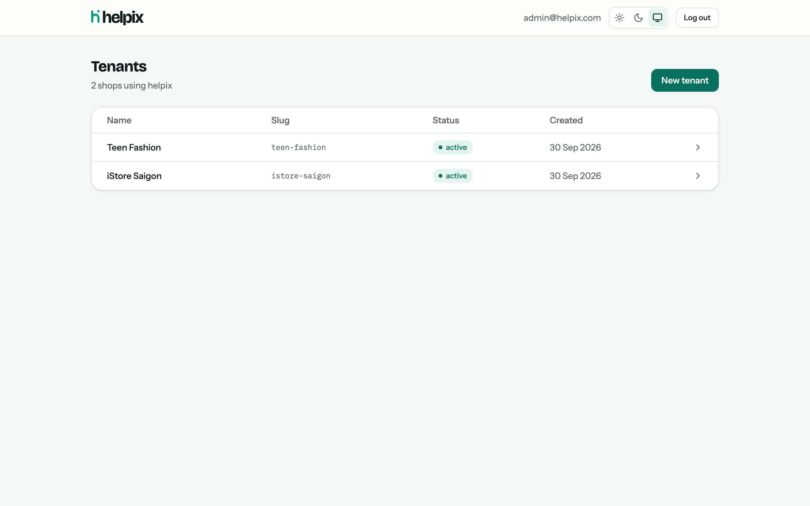
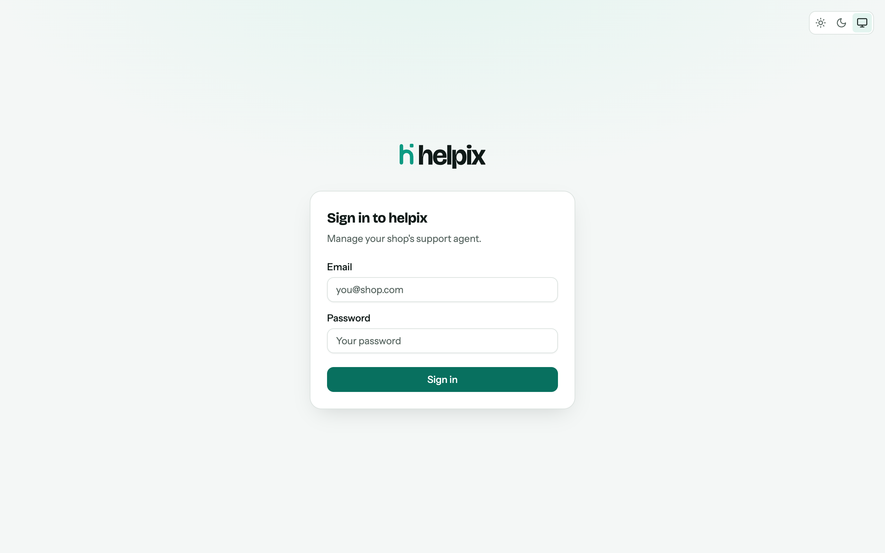
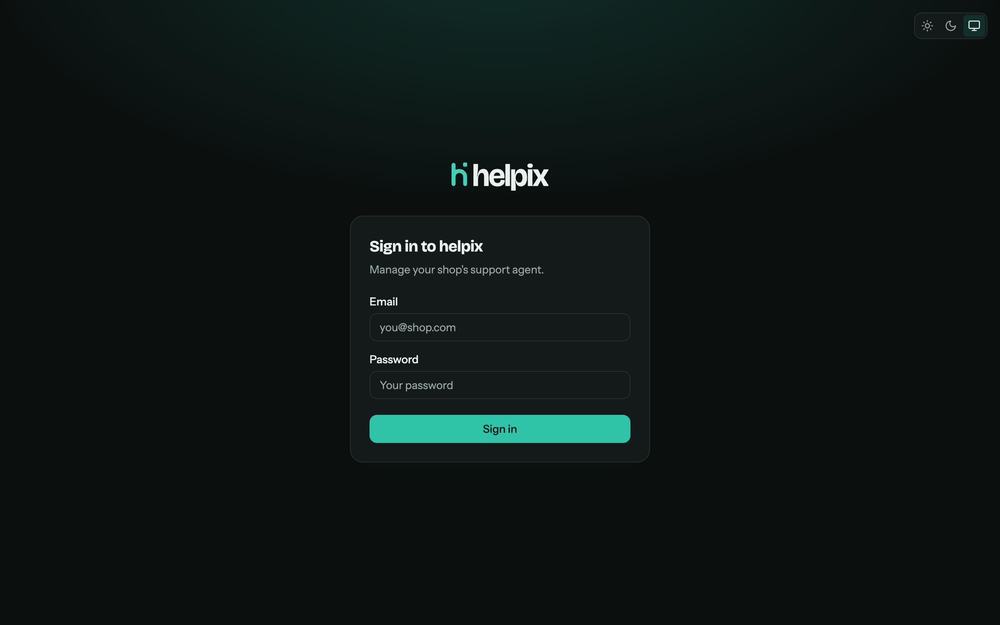
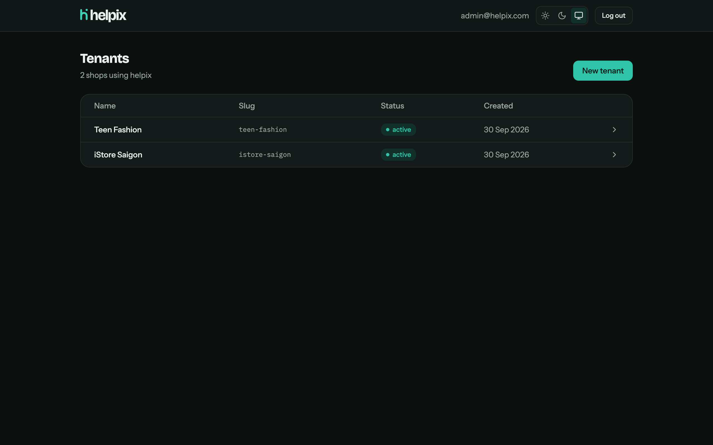
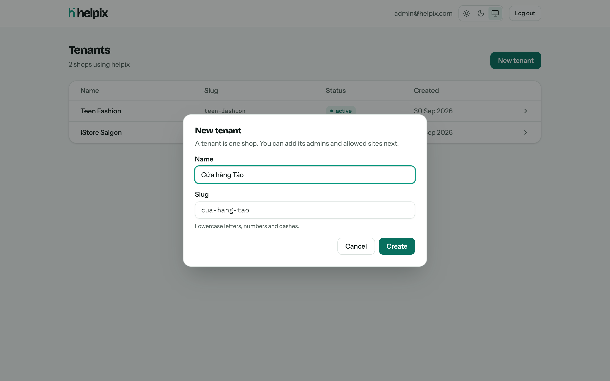
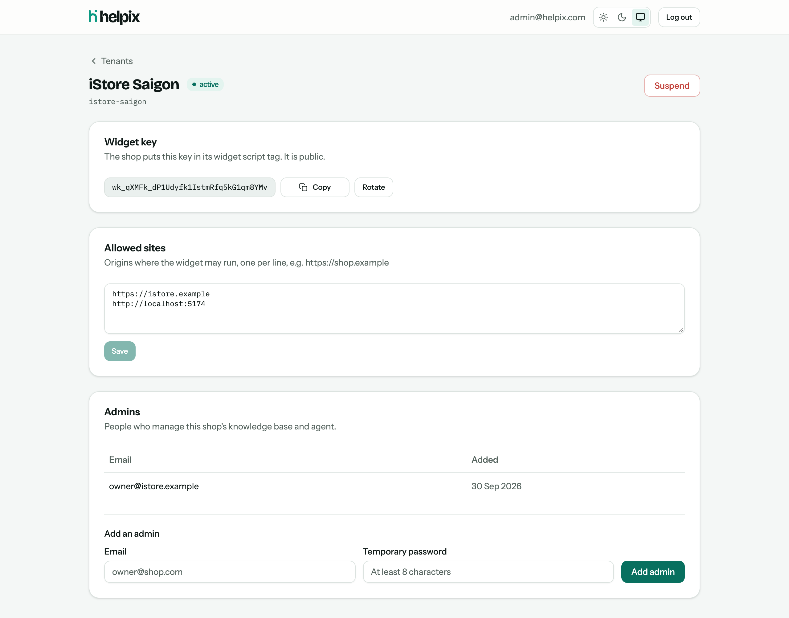
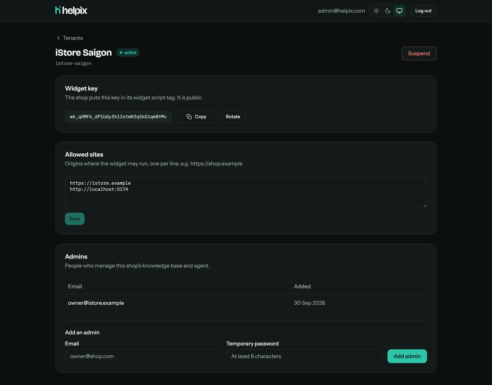
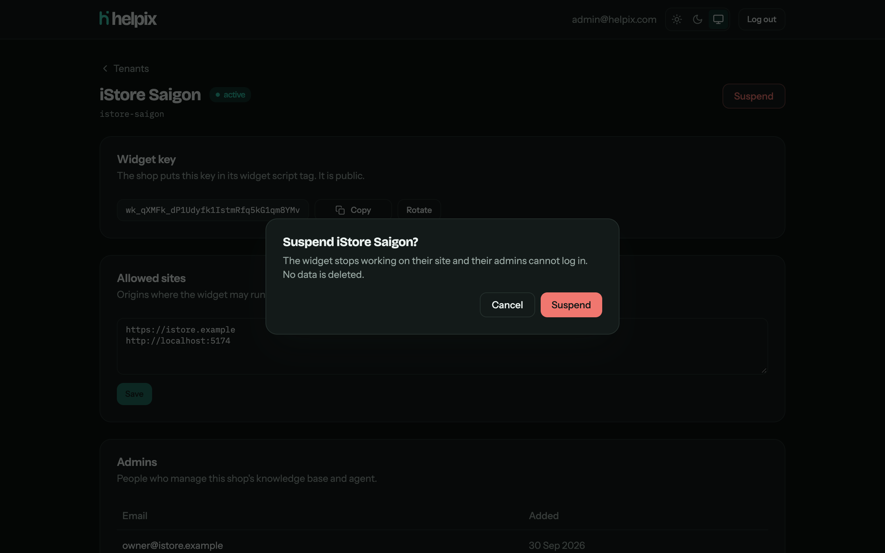
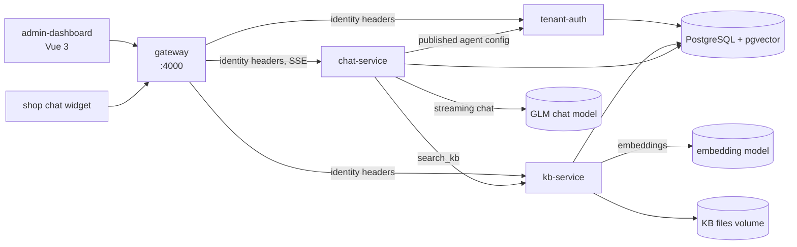

<p align="center">
  <picture>
    <source media="(prefers-color-scheme: dark)" srcset="brand/logo/lockup/helpix-lockup-on-dark.svg">
    
  </picture>
</p>

<p align="center">
  <strong>The AI support agent that lives in a shop's chat widget.</strong><br>
  A multitenant customer-support platform: one helpix, many shops.
</p>

<p align="center">
  
  
  
  
  
  
</p>

<p align="center">
  <a href="#admin-dashboard">Dashboard</a> ·
  <a href="#run-locally">Run locally</a> ·
  <a href="#test">Test</a> ·
  <a href="#architecture">Architecture</a> ·
  <a href="docs/superpowers/specs/2026-09-30-helpix-design.md">Design spec</a>
</p>

<p align="center">
  
</p>

---

## Admin dashboard

The dashboard (`apps/admin-dashboard`) is the UI over **tenant-auth**. Every screen below talks to it through the gateway. A super-admin creates tenants (one per shop), manages each shop's widget key and allowed sites, adds the shop's admins, and can suspend a shop. Light and dark themes follow the system setting, or can be picked in the header.

Tenant admins land on the **Knowledge base**: upload PDF, DOCX, Markdown or TXT files (up to 10 MB) or paste text, watch each document go from *Processing* to *Ready*, preview it (PDFs in the browser viewer, Markdown rendered, DOCX as extracted text), download or delete it, and re-index after the embedding model changes.

On **Agent**, a tenant admin writes the agent's instructions, picks a tone, sets the widget greeting and colour, and tests all of it in the **playground** before publishing. The playground runs the real agent and knowledge base on the unsaved settings, and the reply streams in with the documents it used as source chips. **Conversations** lists every chat, from customers or from the playground. Each transcript shows what the agent looked up for every reply.

### 🔐 Sign in

Admins sign in with email and password. tenant-auth issues a 15-minute access token and a rotating refresh token; the dashboard refreshes silently.

| Light | Dark |
| --- | --- |
|  |  |

### 🏪 Tenants

Every shop using helpix, with its status. Click a row to open it.

| Light | Dark |
| --- | --- |
|  |  |

### ➕ Create a tenant

The slug is filled in from the name, including Vietnamese names (`Cửa hàng Táo` → `cua-hang-tao`).

<p align="center">
  
</p>

### 🔑 Tenant detail

| | |
| --- | --- |
| **Widget key** | The public key the shop puts in its widget script tag. Copy it, or rotate it if it leaks. |
| **Allowed sites** | The origins where the widget may run. Entries are normalized (`https://Shop.Example/` → `https://shop.example`). |
| **Admins** | The people who manage this shop's knowledge base and agent. |

| Light | Dark |
| --- | --- |
|  |  |

### ⏸️ Suspend a tenant

Suspending stops the shop's widget and blocks its admins from signing in. No data is deleted, and the tenant can be reactivated.

<p align="center">
  
</p>

> [!TIP]
> To refresh these images after a UI change, run the stack and dashboard (`make start` or `make dev`), then `make screenshots`. It creates the demo tenants if they are missing and uses your installed Google Chrome.

## Run locally

**Requirements:** Node 22, Docker, make.

```bash
make setup    # npm install; creates .env from .env.example (then change the secrets)
make start    # Docker stack (postgres :5433, tenant-auth, kb-service, chat-service, gateway http://localhost:4000) + dashboard http://localhost:5173
make dev      # or: hot reload — postgres in Docker, services and dashboard run locally; Ctrl-C stops all
make down     # stop the Docker stack (data is kept)
make reset-db # delete ALL data and reseed the super-admin from .env (asks first; FORCE=1 skips)
```

Embeddings default to an offline `fake` provider, which is fine for development. For real answers use GLM: set `EMBEDDING_PROVIDER=openai-compatible` and `EMBEDDING_API_KEY` in `.env` (see `.env.example`). If your `.env` predates the knowledge base, copy the `KB_SERVICE_URL` and `EMBEDDING_*` lines from `.env.example` into it. kb-service needs pgvector 0.8 or newer (the Docker image `pgvector/pgvector:pg16` provides it), because search uses `hnsw.iterative_scan`.

The agent's chat model is configured separately, with the `CHAT_*` variables. `CHAT_PROVIDER=fake` works offline: it searches the knowledge base and quotes the top hit, which is enough to try the playground. For real answers, set `CHAT_PROVIDER=openai-compatible` and `CHAT_API_KEY` (GLM `glm-4.5-air` by default). If your `.env` predates the agent, add `CHAT_SERVICE_URL=http://localhost:4003` and the other `CHAT_*` lines from `.env.example`.

Run `make` to list every target. Without make: `docker compose up -d --build` then `npm run dev -w apps/admin-dashboard`.

Log in with `SEED_SUPERADMIN_EMAIL` / `SEED_SUPERADMIN_PASSWORD` from `.env`.

## Chat widget and demo shop

Any shop embeds the support widget with one script tag (use your gateway URL and the tenant's widget key):

```html
<script src="http://localhost:4000/widget/helpix-widget.js" data-widget-key="wk_..." defer></script>
```

To try it, start the stack (`make start` or `make dev`) and run `make seed-demos`. It creates the Orchard Store tenant with its knowledge base and published agent config, and writes the widget key to `demos/iphone-store/.env.development.local`. Then open the store at http://localhost:5174 (restart the demo dev server if it was already running). Sign in to the dashboard as the shop admin with the credentials in `demos/iphone-store/seed/shop.json`.

The widget only works from origins on the tenant's allowed-origin list, which the super-admin edits on the tenant page (`make seed-demos` sets it for the demo). Pages can control it with `window.Helpix.open()` and `window.Helpix.close()`.

**Shadow DOM styling.** The widget renders inside a shadow root so the shop's CSS cannot touch it. Spike results (verified in Chrome): inside a shadow root Tailwind 4's `@property` rules are ignored, so shadows, rings, transforms and gradients computed to `none`. The fix (`shadowSafeCss` in `apps/widget/src/shadowStyles.ts`) re-declares each registered `--tw-*` initial value in a `@layer properties` rule prepended to the CSS, so every utility still overrides it; with it the shadow-root rendering matched the light DOM exactly. Theme tokens must also be declared on `:host` (`:root` matches nothing in a shadow root), and `:host { all: initial }` stops the shop page's inherited font and colour leaking in. A native `<dialog>` works inside the shadow root (top layer, styled backdrop).

## Test

```bash
make test       # starts postgres if needed; tests use the helpix_test database on port 5433
make typecheck
make smoke      # end-to-end through the gateway (tenants, knowledge base, agent, widget); needs the full stack running (make up)
```

> [!NOTE]
> TypeScript is pinned to ~5.9 at the root (vue-tsc does not support TS 7).

## Architecture



| Path | What it is |
| --- | --- |
| `services/gateway` | The only public entry point; resolves credentials into identity headers. |
| `services/tenant-auth` | Tenants, admins, widget keys, sessions. Reachable only through the gateway. |
| `services/kb-service` | Knowledge base: uploads, text extraction, chunking, embeddings, pgvector search, re-indexing. Reachable only through the gateway. |
| `services/chat-service` | The agent: prompt assembly, the `search_kb` tool loop, SSE streaming, conversations and their ownership, the admin playground. Reachable only through the gateway. |
| `packages/llm` | Provider adapter: OpenAI-compatible embeddings and streaming chat (GLM), plus offline fakes. |
| `packages/shared` | Error format, header names, DB helpers, API types. |
| `packages/ui` | Shared Tailwind components (`@helpix/ui`) and theme tokens. |
| `apps/admin-dashboard` | Super-admin and tenant-admin UI. |
| `brand` | Logo, lockups, app icons and the [brand sheet](brand/brand-sheet.html). |

> [!IMPORTANT]
> The gateway caches admin-token resolutions for up to 30 s (`RESOLVE_CACHE_TTL_MS`), so suspending a tenant or revoking an admin takes effect at the gateway within that window.

---

<p align="center">
  <br>
  <sub>h for help, the pixel for pix.</sub>
</p>
